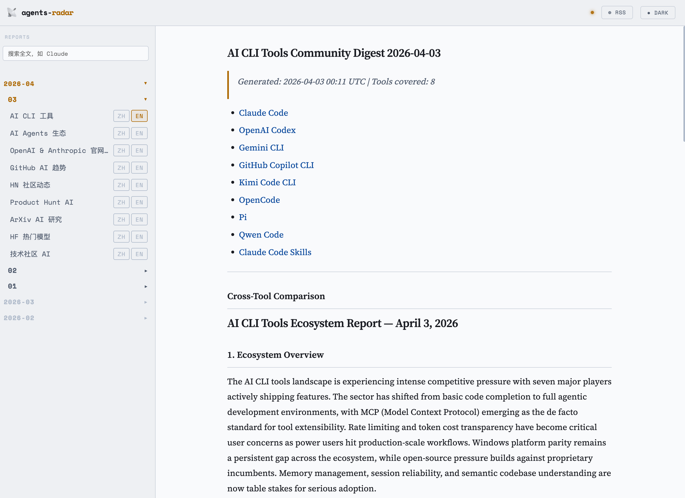

# sift

English | [中文](./README.zh.md)

A personal AI digest. A manually triggered GitHub Actions workflow aggregates signals from 10 AI-ecosystem data sources and publishes bilingual (Chinese + English) reports as GitHub Issues and committed Markdown files.

The piece that makes it mine is a **relevance pre-filter**: an interest profile in `config.yml` gates whole sources and scores individual items *before* any LLM call, so the digest reflects what I actually care about and costs far fewer tokens.

### Data Sources

| Source | Type | Data |
|--------|------|------|
| [GitHub Repos](https://github.com) | API | Issues, PRs, releases from 18 tracked AI tool repos |
| [Claude Code Skills](https://github.com/anthropics/skills) | API | Trending skills sorted by community engagement |
| [GitHub Trending](https://github.com/trending) | HTML + API | Daily trending repos + AI topic search (7-day window) |
| [Hacker News](https://news.ycombinator.com) | [Algolia API](https://hn.algolia.com/api) | Top 30 AI stories from last 24h, 6 parallel queries |
| [Product Hunt](https://www.producthunt.com) | GraphQL API | Yesterday's top AI products by votes |
| [ArXiv](https://arxiv.org) | [ArXiv API](https://export.arxiv.org/api/query) | Latest papers from cs.AI, cs.CL, cs.LG (last 48h) |
| [Hugging Face](https://huggingface.co) | [Hub API](https://huggingface.co/api/models) | 30 trending models sorted by weekly likes — **weekly**, Mondays only |
| [Dev.to](https://dev.to) | [Forem API](https://dev.to/api) | Top AI/LLM articles from 5 tags |
| [Lobste.rs](https://lobste.rs) | JSON API | AI/ML tagged stories from last 7 days |
| [Anthropic](https://anthropic.com) + [OpenAI](https://openai.com) | Sitemap | New articles detected via `lastmod` diff |

## Web UI

**[https://beforelanding.github.io/sift](https://beforelanding.github.io/sift)**

Browse all historical digests in a clean, dark-themed interface — no login required. Reports are rendered from the Markdown files in this repo via GitHub Pages.



## RSS Feed

**[https://beforelanding.github.io/sift/feed.xml](https://beforelanding.github.io/sift/feed.xml)**

Subscribe in any RSS reader (Feedly, Reeder, NewsBlur, etc.) to receive new digests when they are published. The feed includes the latest 30 reports across all report types and is updated alongside `manifest.json`.

## MCP Server

An [MCP](https://modelcontextprotocol.io) server in `mcp/` exposes the digests as tools, so any MCP-compatible client (Claude Desktop, OpenClaw, …) can query the latest reports directly.

**Available tools:**

| Tool | Description |
|------|-------------|
| `list_reports` | List available dates and report types (last N days) |
| `get_latest` | Fetch the most recent report of a given type |
| `get_report` | Fetch a specific report by date and type |
| `search` | Keyword search across recent reports |

**Deploy your own** — the worker lives in `mcp/`, self-hosted on Cloudflare, and reads the digest Markdown from this repo's GitHub Pages site:

```bash
cd mcp
pnpm install
wrangler deploy
```

`PAGES_URL` in `mcp/src/index.ts` must point at the Pages site the worker reads — change it if you deploy under a different domain.

**Claude Desktop** — add the deployed worker to `~/Library/Application Support/Claude/claude_desktop_config.json`:

```json
{
  "mcpServers": {
    "sift": {
      "url": "https://<your-worker>.workers.dev"
    }
  }
}
```

**OpenClaw** — add it manually to `~/.openclaw/openclaw.json`:

```json
{
  "mcpServers": {
    "sift": {
      "type": "http",
      "url": "https://<your-worker>.workers.dev"
    }
  }
}
```

Then you can ask things like:
- *"What's the latest in AI CLI tools?"* → calls `get_latest`
- *"Search for Claude Code mentions this week"* → calls `search`
- *"Show me the AI trending report for 2026-03-05"* → calls `get_report`

## Tracked sources

### AI CLI tools (GitHub)

| Tool | Repository |
|------|-----------|
| Claude Code | [anthropics/claude-code](https://github.com/anthropics/claude-code) |
| OpenAI Codex | [openai/codex](https://github.com/openai/codex) |
| Gemini CLI | [google-gemini/gemini-cli](https://github.com/google-gemini/gemini-cli) |
| GitHub Copilot CLI | [github/copilot-cli](https://github.com/github/copilot-cli) |
| OpenCode | [anomalyco/opencode](https://github.com/anomalyco/opencode) |
| Pi | [earendil-works/pi](https://github.com/earendil-works/pi) |
| Qwen Code | [QwenLM/qwen-code](https://github.com/QwenLM/qwen-code) |

Repos marked `discussions: true` in `config.yml` (Codex, Pi) also have their GitHub Discussions
pulled in.

### Claude Code Skills (GitHub)

| Source | Repository |
|--------|-----------|
| Claude Code Skills | [anthropics/skills](https://github.com/anthropics/skills) |

PRs and issues are fetched without a date filter and sorted by popularity (comment count), so the report always reflects the most actively discussed skills — not just the newest.

### OpenClaw + AI agent ecosystem (GitHub)

OpenClaw is tracked as the primary reference project, alongside several peer projects in the personal AI assistant / autonomous agent space for cross-ecosystem comparison.

| Project | Repository | Stars |
|---------|-----------|-------|
| OpenClaw | [openclaw/openclaw](https://github.com/openclaw/openclaw) | 387.8k |
| Hermes Agent | [nousresearch/hermes-agent](https://github.com/nousresearch/hermes-agent) | 237.0k |
| QwenPaw | [agentscope-ai/QwenPaw](https://github.com/agentscope-ai/QwenPaw) | 34.5k |
| ZeroClaw | [zeroclaw-labs/zeroclaw](https://github.com/zeroclaw-labs/zeroclaw) | 32.7k |
| IronClaw | [nearai/ironclaw](https://github.com/nearai/ironclaw) | 12.6k |

### AI infrastructure (GitHub)

The inference and serving layer the agent/CLI tools run on top of — tracked in a dedicated report with its own cross-project comparison.

| Project | Repository | Layer | Stars |
|---------|-----------|-------|-------|
| Ollama | [ollama/ollama](https://github.com/ollama/ollama) | Local runtime | 177.2k |
| llama.cpp | [ggml-org/llama.cpp](https://github.com/ggml-org/llama.cpp) | Inference engine | 121.9k |
| vLLM | [vllm-project/vllm](https://github.com/vllm-project/vllm) | Serving engine | 87.5k |
| Unsloth | [unslothai/unsloth](https://github.com/unslothai/unsloth) | Fine-tuning | 69.0k |
| LiteLLM | [BerriAI/litellm](https://github.com/BerriAI/litellm) | LLM gateway | 55.0k |
| SGLang | [sgl-project/sglang](https://github.com/sgl-project/sglang) | Serving engine | 30.9k |

Summaries focus on new model/hardware support, performance work, breaking changes, and what each change means for developers building on top of these projects.

### GitHub AI Trending

Two data sources are fetched in parallel every day:

| Source | Details |
|--------|---------|
| [github.com/trending](https://github.com/trending?since=daily) | Today's trending repos — parsed from HTML; includes today's new star count |
| GitHub Search API | Repos active in the last 7 days matching 6 AI topics: `llm`, `ai-agent`, `rag`, `vector-database`, `large-language-model`, `machine-learning` |

The LLM filters out non-AI repos from the trending list, classifies the rest by dimension (AI infrastructure / agents / applications / models / RAG), and extracts trend signals.

### Hacker News

Top AI stories from the last 24 hours, fetched via the [Algolia HN Search API](https://hn.algolia.com/api). Six queries run in parallel (`AI`, `LLM`, `Claude`, `OpenAI`, `Anthropic`, `machine learning`), results are deduplicated and ranked by points. The top 30 stories are passed to the LLM for analysis.

### Official web content (sitemap-based)

| Organization | Site | Tracked sections |
|---|---|---|
| Anthropic | [anthropic.com](https://www.anthropic.com) | `/news/`, `/research/`, `/engineering/`, `/learn/` |
| OpenAI | [openai.com](https://openai.com) | research, publication, release, company, engineering, milestone, learn-guides, safety, product |

New articles are detected by comparing sitemap `lastmod` timestamps against a persisted state file (`digests/web-state.json`). On the **first run**, up to 25 recent articles per site are fetched and a comprehensive overview report is generated. On subsequent runs, only new or updated URLs trigger a report; if nothing changed, the web report step is skipped entirely.

## Features

- **Relevance pre-filter** — gates whole sources and scores individual items against a `config.yml` interest profile before any LLM call, then fails open on every error path so a filter outage never blanks a report
- Fetches issues, pull requests, and releases updated in the last 24 hours across all tracked repos
- Tracks trending Claude Code Skills — sorted by community engagement, not recency
- Generates a per-tool summary for each CLI repository and a cross-tool comparative analysis
- Generates a deep OpenClaw project report plus a cross-ecosystem comparison against 4 peer projects
- Tracks 6 AI infrastructure projects (inference engines, gateways, fine-tuning) with a dedicated report and cross-project comparison
- Scrapes official Anthropic and OpenAI web content via sitemaps; detects new articles incrementally
- Monitors GitHub Trending daily + searches 6 AI topic tags; classifies repos by dimension and extracts trend signals
- Fetches top-30 AI stories from Hacker News (last 24h, ranked by points); generates community sentiment report
- Publishes GitHub Issues for each report type; commits Markdown files to `digests/YYYY-MM-DD/`
- Generates every report body once in English and translates it to Chinese, instead of running the whole pipeline twice per language
- Runs manually via GitHub Actions
- All tracked repositories are configurable via `config.yml` — no code changes needed

## LLM providers

Set `LLM_PROVIDER` to choose which model backend powers the digest generation. Defaults to `anthropic`.

| Provider | `LLM_PROVIDER` | Required env vars | Default model |
|----------|---------------|-------------------|---------------|
| Anthropic | `anthropic` | `ANTHROPIC_API_KEY` | `claude-sonnet-4-6` |
| OpenAI | `openai` | `OPENAI_API_KEY` | `gpt-4o` |
| GitHub Copilot | `github-copilot` | `GITHUB_TOKEN` | `gpt-4o` |
| OpenRouter | `openrouter` | `OPENROUTER_API_KEY` | `anthropic/claude-sonnet-4` |
| DeepSeek | `deepseek` | `DEEPSEEK_API_KEY` | `deepseek-v4-flash` |
| Qwen | `qwen` | `DASHSCOPE_API_KEY` | `qwen-flash` |

Override the model name with `ANTHROPIC_MODEL`, `OPENAI_MODEL`, `GITHUB_COPILOT_MODEL`, `OPENROUTER_MODEL`, `DEEPSEEK_MODEL`, or `QWEN_MODEL` respectively. The Qwen endpoint can be overridden with `DASHSCOPE_BASE_URL`.

The GitHub Actions workflow uses `qwen` / `qwen-flash`.

The provider abstraction lives in `src/providers/` — each provider is a separate file implementing the `LlmProvider` interface. Adding a new provider only requires creating a new file and registering it in the factory.

## Running locally

```bash
pnpm install

export GITHUB_TOKEN=ghp_xxxxx

# Option A: Anthropic (default)
export ANTHROPIC_API_KEY=sk-ant-xxxxxxxx

# Option B: OpenAI
# export LLM_PROVIDER=openai
# export OPENAI_API_KEY=sk-xxxxxxxx

# Option C: GitHub Copilot (uses GITHUB_TOKEN)
# export LLM_PROVIDER=github-copilot

# Option D: OpenRouter
# export LLM_PROVIDER=openrouter
# export OPENROUTER_API_KEY=sk-or-xxxxxxxx

# Option E: DeepSeek
# export LLM_PROVIDER=deepseek
# export DEEPSEEK_API_KEY=sk-xxxxxxxx

# Qwen (Alibaba Model Studio)
# export LLM_PROVIDER=qwen
# export DASHSCOPE_API_KEY=sk-xxxxxxxx

export DIGEST_REPO=your-username/sift  # optional; omit to only write files

pnpm start
```

## Output format

Files are written to `digests/YYYY-MM-DD/`:

| File | Content | GitHub Issue label |
|------|---------|-------------------|
| `ai-cli.md` | CLI digest — cross-tool comparison + per-tool details | `digest` |
| `ai-agents.md` | OpenClaw deep report + cross-ecosystem comparison + 4 peer details | `openclaw` |
| `ai-infra.md` | AI infrastructure digest — cross-project comparison + per-project details | `infra` |
| `ai-web.md` | Official web content report (only written when new content exists) | `web` |
| `ai-trending.md` | GitHub AI trending report — repos classified by dimension + trend signals (only written when data is available) | `trending` |
| `ai-hn.md` | Hacker News AI community digest — top stories + sentiment analysis (only written when fetch succeeds) | `hn` |
| `ai-ph.md` | Product Hunt AI products digest (only written when `PRODUCTHUNT_TOKEN` is set and data is available) | `ph` |
| `ai-arxiv.md` | ArXiv AI research digest — key papers from cs.AI/cs.CL/cs.LG | `arxiv` |
| `ai-hf.md` | Hugging Face trending models digest — sorted by weekly likes (**weekly**: written on Mondays only) | `hf` |
| `ai-community.md` | Tech community AI digest — Dev.to articles + Lobste.rs stories combined | `community` |

A shared state file `digests/web-state.json` tracks which web URLs have been seen; it is committed alongside the daily digests.

Each report is generated in both Chinese (`ai-cli.md`) and English (`ai-cli-en.md`). The Web UI sidebar shows ZH / EN toggle buttons for reports that have both variants.

---

`ai-cli.md` / `ai-cli-en.md` structure:
```
## Cross-Tool Comparison
  Ecosystem overview / Activity comparison table / Shared themes / Differentiation / Trend signals

## Per-Tool Reports
  <details> Claude Code    — [Claude Code Skills Highlights]
                             Top skills / Community demand trends / High-potential pending skills
                             ---
                             Today's summary / Hot issues / PR progress / Trends
  <details> OpenAI Codex   — Today's summary / Hot issues / PR progress / Trends
  <details> Gemini CLI     — ...
  <details> GitHub Copilot CLI — ...
  <details> OpenCode       — ...
  <details> Pi             — ...
  <details> Qwen Code      — ...
```

`ai-agents.md` / `ai-agents-en.md` structure:
```
Issues: N | PRs: N | Projects covered: 5

## OpenClaw Deep Dive
  Today's summary / Releases / Project progress / Community highlights /
  Bug stability / Feature requests / User feedback / Backlog

## Cross-Ecosystem Comparison
  Ecosystem overview / Activity table / OpenClaw positioning /
  Shared technical directions / Differentiation / Community maturity / Trend signals

## Peer Project Reports
  <details> ZeroClaw     — Today's summary / Releases / Progress / ... (8 sections)
  <details> Hermes Agent — ...
  <details> IronClaw     — ...
  <details> QwenPaw      — ...
```

`ai-infra.md` / `ai-infra-en.md` structure:
```
Projects covered: 6

## Cross-Project Comparison
  Ecosystem overview / Activity table / Model support race /
  Performance frontier / Layer positioning / Trend signals

## Per-Project Reports
  <details> vLLM       — Today's highlights / Releases & breaking changes /
                         New model & hardware support / Performance & optimization /
                         Stability & regressions / What it means for app developers
  <details> SGLang     — ...
  <details> llama.cpp  — ...
  <details> Ollama     — ...
  <details> LiteLLM    — ...
  <details> Unsloth    — ...
```

`ai-web.md` / `ai-web-en.md` structure:
```
Sources: anthropic.com (N articles) + openai.com (N articles)

Today's summary
Anthropic / Claude highlights  (news / research / engineering / learn)
OpenAI highlights              (research / release / company / safety / ...)
Strategic signals
Notable details
[First full crawl also includes: Content landscape overview]
```

`ai-trending.md` / `ai-trending-en.md` structure:
```
Sources: GitHub Trending + GitHub Search API

Today's summary
Top repos by dimension
  🔧 AI Infrastructure  — frameworks / SDKs / inference engines / CLIs
  🤖 AI Agents          — agent frameworks / multi-agent / automation
  📦 AI Applications    — vertical products / solutions
  🧠 Models & Training  — model weights / training frameworks / fine-tuning
  🔍 RAG & Knowledge    — vector databases / retrieval augmentation
Trend signal analysis
Community focus
```

`ai-hn.md` / `ai-hn-en.md` structure:
```
Sources: Hacker News (top-30 AI stories, last 24h)

Today's summary
Top stories & discussions
  🔬 Models & Research  — new model releases / papers / benchmarks
  🛠️ Tools & Engineering — open-source projects / frameworks / engineering practice
  🏢 Industry news      — company news / funding / product launches
  💬 Opinions & debate  — Ask HN / Show HN / hot threads
Community sentiment signals
Worth reading
```

Historical digests are stored in [`digests/`](./digests/). Published issues are tagged by type: [`digest`](../../issues?q=is%3Aissue+label%3Adigest) · [`openclaw`](../../issues?q=is%3Aissue+label%3Aopenclaw) · [`web`](../../issues?q=is%3Aissue+label%3Aweb) · [`trending`](../../issues?q=is%3Aissue+label%3Atrending) · [`hn`](../../issues?q=is%3Aissue+label%3Ahn) · [`ph`](../../issues?q=is%3Aissue+label%3Aph) · [`arxiv`](../../issues?q=is%3Aissue+label%3Aarxiv) · [`hf`](../../issues?q=is%3Aissue+label%3Ahf) · [`community`](../../issues?q=is%3Aissue+label%3Acommunity).

Only the most recent day's issues are left open — `pnpm close-stale` closes everything older on each run, so the issue list stays at roughly one day's worth instead of thousands. Nothing is deleted: the label links above include closed issues, and the full archive also lives under `digests/` and in the Web UI. Issues without a digest label, and pull requests, are never touched.

Weekly and monthly rollup reports were discontinued in July 2026; past ones remain browsable under `digests/` and in the Web UI.

## Running the workflow

The workflow has no scheduled trigger. To generate a digest, open the repository's **Actions** tab, select **sift**, and choose **Run workflow**. Overlapping manual runs are serialized by the `daily-digest` concurrency group.
